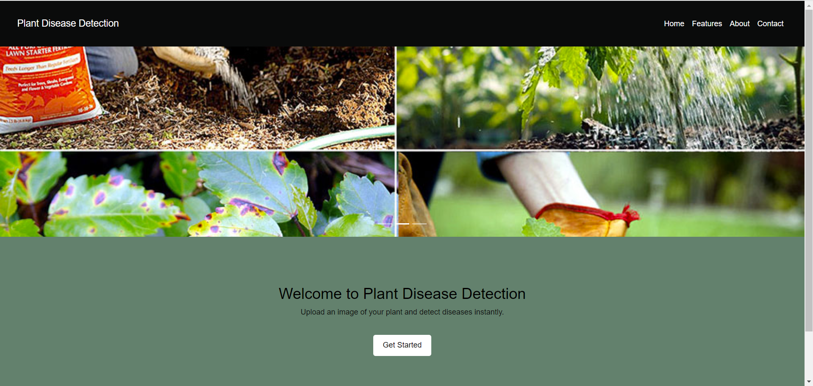
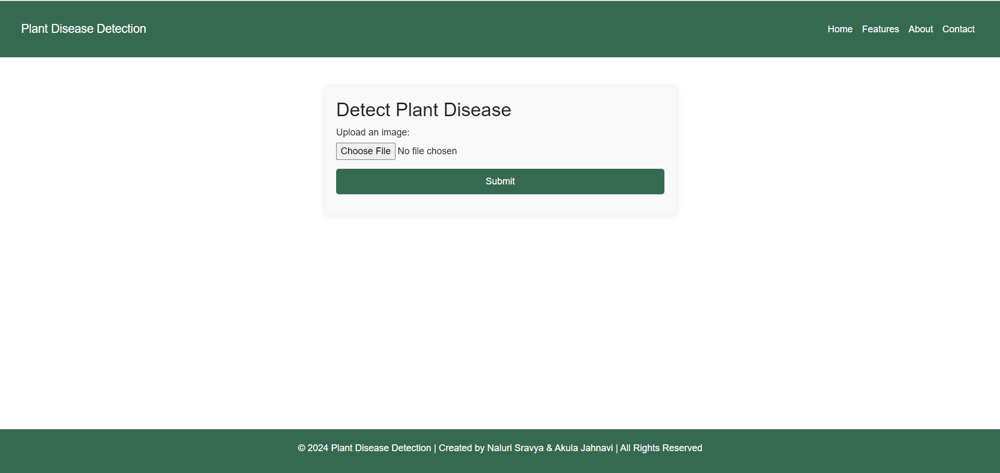
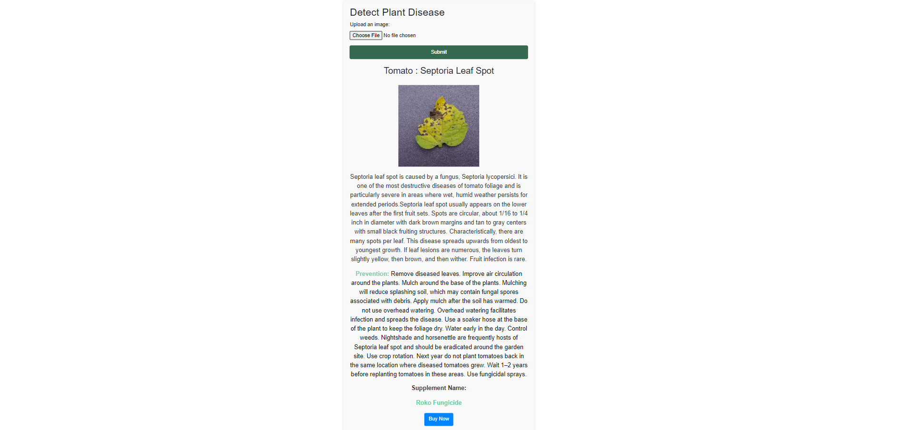
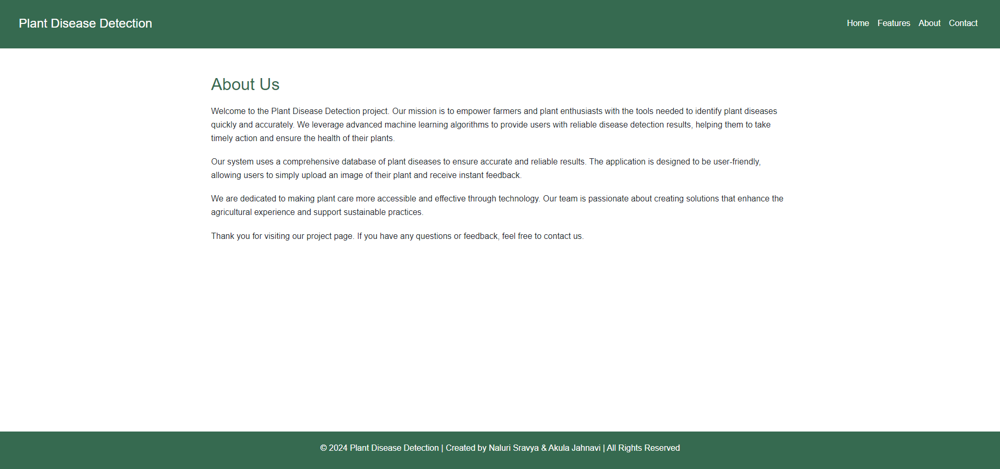
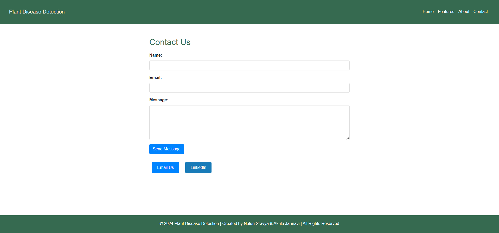

Plant Disease Detection
Table of Contents
Introduction
Features
Installation
Usage
Project Structure
Technologies Used
Contributors
License
Introduction
The Plant Disease Detection project is a web-based application designed to help users detect diseases in plants by uploading images. This application uses a Convolutional Neural Network (CNN) model to classify the disease and provides detailed information on the disease, including preventive measures and supplement recommendations.

Features
Image Upload: Users can upload an image of a plant leaf to detect any potential disease.
Disease Detection: The CNN model analyzes the uploaded image and identifies the disease.
Detailed Information: Users receive a detailed description of the disease, along with preventive measures.
Supplement Recommendations: The application suggests relevant supplements for disease management and provides a direct link to purchase them online.
Responsive Design: The application is designed to be responsive, ensuring it works well on both desktop and mobile devices.
Installation
To run this project locally, follow these steps:

Clone the repository:

bash
Copy code
git clone https://github.com/yourusername/plant-disease-detection.git
Navigate to the project directory:

bash
Copy code
cd plant-disease-detection
Install the required dependencies:

bash
Copy code
pip install -r requirements.txt
Run the Flask application:

bash
Copy code
python app.py
Access the application:
Open your web browser and go to http://127.0.0.1:5000.

Usage
Navigate to the "Detection" page.
Upload an image of a plant leaf using the provided upload button.
Click the "Submit" button to process the image.
The application will display the detected disease, a brief description, preventive measures, and supplement recommendations.
Project Structure
app.py: The main Flask application file.
CNN.py: Contains the CNN model architecture and functions.
templates/: HTML templates for the web pages.
index.html: Homepage.
detection.html: Detection page.
about.html: About page.
contact.html: Contact page.
static/: Static files like images, CSS, and JavaScript.
uploads/: Directory where uploaded images are stored.
images/: Supplementary images.
requirements.txt: Lists all Python dependencies.
disease_info.csv: CSV file containing disease information such as name, description, and prevention.
supplement_info.csv: CSV file containing supplement information like name, image, and buy link.
Technologies Used
Python: Programming language for the backend.
Flask: Web framework used to build the application.
PyTorch: Deep learning framework used to implement the CNN model.
Pandas: Library for data manipulation and analysis.
HTML/CSS: Markup and styling for the frontend.
Bootstrap: Frontend framework for responsive design.
Contributors
NaluriSravya
Akula Jahnavi
License
This project is licensed under the MIT License - see the LICENSE file for details
## ⭐Snippet of Web App :
#### Home page
  
#### Detection page
  
#### detected image details 
  
#### Features
  
#### About us
   
#### Contact
   

