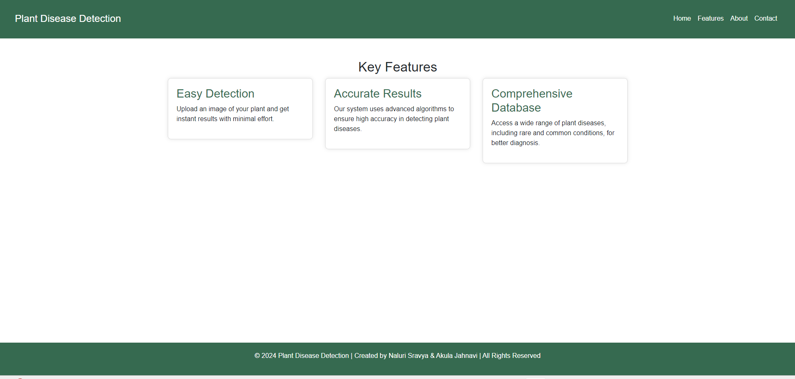

<h2>⭐Plant-Disease-Detection :</h2>

<strong>Table of Contents</strong>

<ul>
    <li><a href="#introduction">Introduction</a></li>
    <li><a href="#features">Features</a></li>
    <li><a href="#usage">Usage</a></li>
    <li><a href="#project-structure">Project Structure</a></li>
    <li><a href="#technologies-used">Technologies Used</a></li>
    <li><a href="#contributors">Contributors</a></li>
</ul>

<h3 id="introduction"><strong>Introduction</strong></h3>

The Plant Disease Detection project is a web-based application designed to help users detect diseases in plants by uploading images. This application uses a Convolutional Neural Network (CNN) model to classify the disease and provides detailed information on the disease, including preventive measures and supplement recommendations.

<h3 id="features"><strong>Features</strong></h3>
<ul>
    <li><strong>Image Upload:</strong> Users can upload an image of a plant leaf to detect any potential disease.</li>
    <li><strong>Disease Detection:</strong> The CNN model analyzes the uploaded image and identifies the disease.</li>
    <li><strong>Detailed Information:</strong> Users receive a detailed description of the disease, along with preventive measures.</li>
    <li><strong>Supplement Recommendations:</strong> The application suggests relevant supplements for disease management and provides a direct link to purchase them online.</li>
    <li><strong>Responsive Design:</strong> The application is designed to be responsive, ensuring it works well on both desktop and mobile devices.</li>
</ul>

<h3 id="usage"><strong>Usage</strong></h3>
<ul>
    <li>Navigate to the "Detection" page.</li>
    <li>Upload an image of a plant leaf using the provided upload button.</li>
    <li>Click the "Submit" button to process the image.</li>
    <li>The application will display the detected disease, a brief description, preventive measures, and supplement recommendations.</li>
</ul>

<h3 id="project-structure"><strong>Project Structure</strong></h3>
<ul>
    <li><strong>app.py:</strong> The main Flask application file.</li>
    <li><strong>CNN.py:</strong> Contains the CNN model architecture and functions.</li>
    <li><strong>templates/:</strong> HTML templates for the web pages.</li>
    <ul>
        <li><strong>Home.html:</strong> Homepage.</li>
        <li><strong>Detection.html:</strong> Detection page.</li>
        <li><strong>About.html:</strong> About page.</li>
        <li><strong>Contact.html:</strong> Contact page.</li>
    </ul>
    <li><strong>static/:</strong> Static files like images.</li>
    <ul>
        <li><strong>uploads/:</strong> Directory where uploaded images are stored.</li>
        <li><strong>images/:</strong> Supplementary images.</li>
    </ul>
    <li><strong>requirements.txt:</strong> Lists all Python dependencies.</li>
    <li><strong>disease_info.csv:</strong> CSV file containing disease information such as name, description, and prevention.</li>
    <li><strong>supplement_info.csv:</strong> CSV file containing supplement information like name, image, and buy link.</li>
</ul>

<h3 id="technologies-used"><strong>Technologies Used</strong></h3>
<ul>
    <li><strong>Python:</strong> Programming language for the backend.</li>
    <li><strong>Flask:</strong> Web framework used to build the application.</li>
    <li><strong>PyTorch:</strong> Deep learning framework used to implement the CNN model.</li>
    <li><strong>Pandas:</strong> Library for data manipulation and analysis.</li>
    <li><strong>HTML/CSS:</strong> Markup and styling for the frontend.</li>
    <li><strong>Bootstrap:</strong> Frontend framework for responsive design.</li>
</ul>

<h3 id="contributors"><strong>Contributors</strong></h3>
<ul>
    <li><strong>NaluriSravya</strong></li>
    <li><strong>Akula Jahnavi</strong></li>
</ul>

<h2>⭐Snippet of Web App :</h2>
<h4>Home page</h4>
 

<h4>Detection page</h4>
 

<h4>Detected image details</h4>
 

<h4>Features</h4>
 

<h4>About us</h4>
  

<h4>Contact</h4>
  
